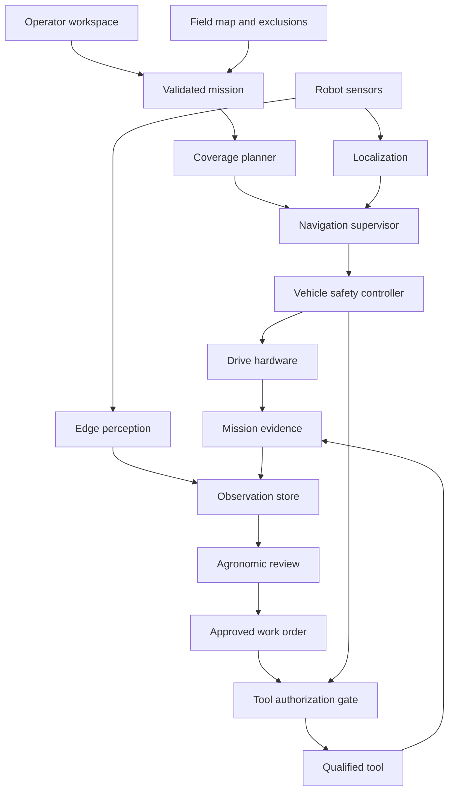
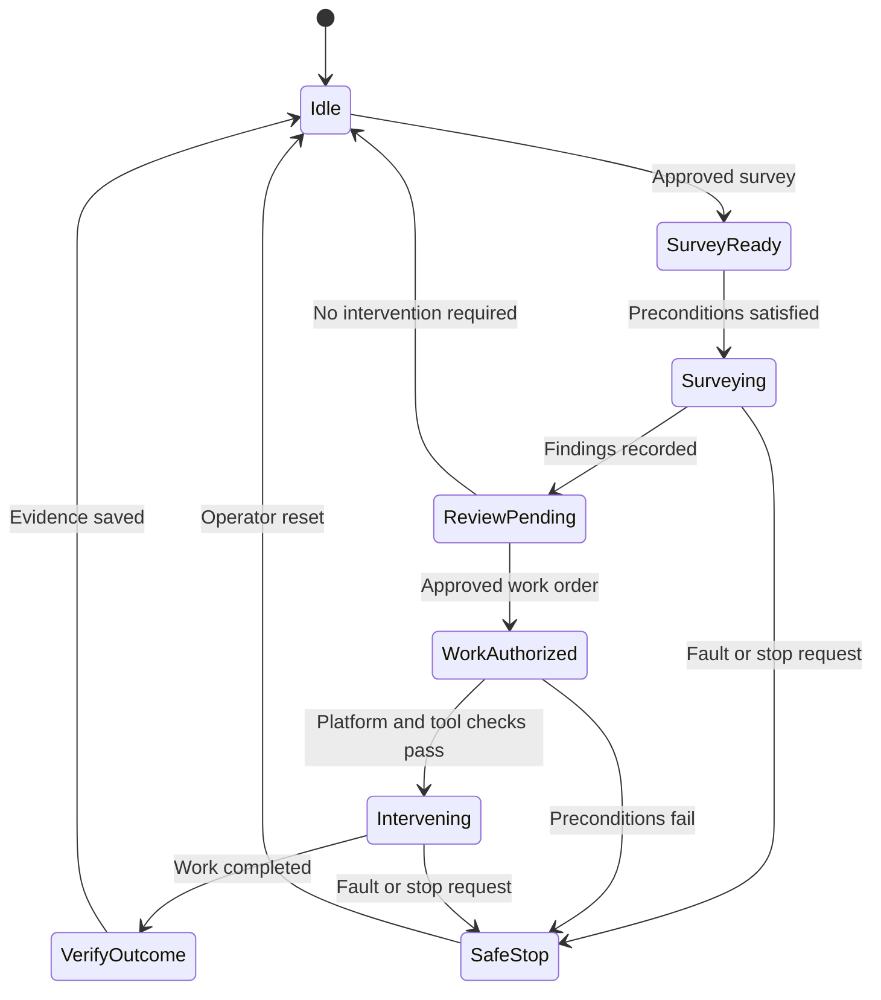

# jfxai4rpcs

## Open-Source AI Integration for Robotic Pest Control and Precision Agriculture

**A modular engineering proposal connecting agricultural robots, field perception, coverage planning, crop-health evidence and supervised pest-management workflows.**

[Project repository](https://github.com/robotics-intelligent-systems/jfxai4rpcs) · [Original software compendium](https://github.com/robotics-intelligent-systems/jfxai4rpcs/blob/main/README.md)

> **Architecture proposal — September 14, 2026.** The inspected repository currently contains its README compendium. The packages, interfaces, simulations and deployment profiles below are proposed work. Existing upstream capabilities must be qualified on the selected robot and operating environment.

### Suggested GitHub About Description

Open-source AI and robotics for agricultural scouting, pest detection, field mapping and supervised precision interventions, integrating ROS 2, coverage planning, edge inference, digital twins and local knowledge assistance.

## 1. Project Vision

jfxai4rpcs proposes an integration platform for AI-assisted agricultural inspection and robotic pest management. It connects the 24 components named in the original description through a shared mission model, documented interfaces and reproducible validation.

The recommended starting point is one wheeled inspection robot operating in a bounded agricultural area. It collects observations, follows validated routes, maps potential crop-health issues and presents evidence for review. Modular intervention equipment, aerial scouting, quadrupeds and coordinated fleets become separate extensions.

The platform combines three complementary capabilities:

- **Robotics:** localization, coverage planning, row navigation, obstacle response and vehicle control.
- **Agricultural intelligence:** pest and disease observations, crop/weed distinction, geospatial context and agronomist-reviewed decisions.
- **Engineering assistance:** searchable technical documentation, experiment design, configuration review and traceable reporting.

The alternative architecture uses an open robotics runtime and local AI inference as its foundation. Cloud services can support model training and fleet reporting when useful, while a qualified edge configuration remains able to complete its approved mission without continuous cloud access.

## 2. Scope and Operating Concept

### Initial application

Define one crop, one field layout, one robot configuration and a locally relevant label set before collecting training data. The initial workflow is:

1. Import and review the field boundary, crop rows and exclusion areas.
2. Generate a survey route appropriate to the vehicle geometry.
3. Collect synchronized images, location estimates and sensor metadata.
4. Produce georeferenced observations with uncertainty and evidence references.
5. Review findings and determine whether further inspection or intervention is justified.
6. Record the outcome and compare later observations.

Agricultural decisions should follow a documented integrated pest management process: identification, monitoring, locally defined action thresholds, prevention and selection of an appropriate response. The presence of an insect alone does not establish a need for treatment. See the [EPA overview of integrated pest management](https://www.epa.gov/safepestcontrol/integrated-pest-management-ipm-principles).

### Development profiles

| Profile | Role | Proposed status |
| --- | --- | --- |
| Wheeled scout | Ground inspection, mapping and evidence collection | MVP |
| Intervention rover | Carry an approved mechanical or application tool | Subsequent qualified extension |
| Aerial scout | Survey large areas and identify locations for closer inspection | Optional extension |
| Quadruped | Investigate terrain where a wheeled platform is unsuitable | Research extension |
| Fixed agricultural gantry | Conduct repeatable experiments in a bounded growing bed | FarmBot-oriented research profile |
| Coordinated fleet | Assign inspection tasks across multiple qualified robots | Later-stage extension |

Aerial imagery may locate suspicious areas, but image resolution and viewing conditions can require close inspection before species-level identification. Capabilities demonstrated on one profile do not automatically transfer to another.

## 3. Proposed Architecture



The **navigation supervisor** owns the selected navigation mode and its command authority. The **vehicle safety controller** enforces motion constraints and handles stop conditions. The **tool authorization gate** checks whether a specific intervention is permitted under the current conditions.

The perception system creates observations. Agricultural review creates work orders. A language model can help explain evidence or draft records, but it has no direct drive, pump or tool-control interface.

### Integration layers

| Layer | Responsibility | Proposed building blocks |
| --- | --- | --- |
| Physical platform | Mobility, sensing, power and tool interfaces | Qualified rover, encoders, IMU, cameras and optional GNSS/LiDAR |
| Robot runtime | Lifecycle management, transforms, sensor topics and commands | ROS 2 and platform-specific drivers |
| Navigation | Coverage, row following and local obstacle handling | Fields2Cover, Nav2 and selected Agronav/CROW adapters |
| Perception | Detection, segmentation, tracking and quality assessment | OpenCV, PyTorch and a task-trained detector |
| Agronomic workflow | Review evidence and apply approved crop-specific policies | Versioned rules, review interface and work-order service |
| Data services | Maps, observations, media and provenance | PostgreSQL/PostGIS, GeoJSON, GeoTIFF and object/file storage |
| AI lifecycle | Dataset management, evaluation and deployment records | CVAT, MLflow and versioned model artifacts |
| Knowledge assistance | Retrieve technical and approved agricultural guidance | Local RAG and a configurable language-model backend |
| Simulation and MBSE | Requirements, robot models, scenarios and verification evidence | Capella/Arcadia records, Gazebo and specialized simulators |

## 4. Consolidated Compendium and Adoption Plan

The tables retain all 24 entries in the original README. Links point to matching upstream projects or identified portfolio copies. These mappings establish research sources; they do not imply that all components are integrated, maintained to the same standard or covered by one license.

### A. Field operations, companion systems and coordination

| Original component | Proposed contribution | Integration decision |
| --- | --- | --- |
| [Ag Precision Mapping, Section Control and Guidance — AgOpenGPS](https://github.com/AgOpenGPS-Official/AgOpenGPS) | Field geometry, guidance and section-control interoperability | Optional field-data adapter. Its WinForms README states maintenance mode since April 2026 and points to Avalonia development |
| [BotBrain Open Source — BBOSS](https://github.com/botbotrobotics/BotBrain) | Operator UI, robot monitoring and navigation integration patterns | Optional supervisory component. The reviewed baseline uses ROS 2 Humble; qualify its selected modules and dependencies |
| [Rpanion-server](https://github.com/stephendade/Rpanion-server) | Companion-computer network, video and MAVLink telemetry configuration | Aerial/vehicle extension. Keep its system-management role separate from perception and agronomic decisions |
| [Advanced Swarm Robotics for Precision Agriculture Monitoring](https://github.com/RuhamaY/Advanced-Swarm-Robotics-for-Precision-Agriculture-Monitoring) | ROS 2/Gazebo reference for coordinated wheat-rust monitoring | Simulation reference for later task allocation; qualify each robot independently first |
| [AGRO ROVER / AgroRover-IOT](https://github.com/sdk2035/AgroRover-IOT) | Arduino/NodeMCU telemetry and agricultural actuator examples | Educational hardware adapter. Replace direct web-command assumptions with authenticated, bounded command handling |
| [WURC Rover Electrical](https://github.com/Washington-University-Robotics/Rover-Electrical) | Rover electrical notes, code and design references | Hardware study. Review suitability for the chosen agricultural platform |

### B. Perception, mapping and agricultural navigation

| Original component | Proposed contribution | Integration decision |
| --- | --- | --- |
| [AgriDrone AI](https://github.com/sdk2035/AgriDrone-AI) | Leaf-image disease-classification workflow and reporting | Separate disease classifier candidate; validate on field images and review advice independently |
| [wdrone](https://github.com/wdammak/wdrone) | ArduPilot, imagery and geospatial integration concepts | Optional aerial-scouting architecture reference |
| [AgriCruiser](https://github.com/agri-cruiser/agri-cruiser) | Adjustable agricultural chassis and over-row platform design | Wheeled-platform reference. The reviewed implementation describes joystick operation; autonomous operation needs additional integration |
| [Agronav](https://github.com/StructuresComp/agronav) | Semantic segmentation and semantic line detection | Candidate row-perception adapter; its documented Python/PyTorch environment requires migration assessment |
| [CROW](https://github.com/faffonso/crow) | LiDAR-based crop-line perception and MPC navigation | Alternative row-navigation research adapter; the reviewed setup uses ROS Noetic |
| [Fields2Cover](https://github.com/Fields2Cover/Fields2Cover) | Field decomposition, headlands, swaths and coverage paths | Core planning candidate through a pinned ROS 2 integration |
| [CoFly-GUI](https://github.com/CoFly-Project/cofly-gui) | Field-specific UAV mission planning and analysis UX | Optional workflow reference; reconcile map, mission and exclusion-zone formats |

### C. Control, manipulation and robot simulation

| Original component | Proposed contribution | Integration decision |
| --- | --- | --- |
| [ADRL Control Toolbox — CT](https://github.com/ethz-adrl/control-toolbox) | Dynamics, estimation, optimization and controller studies | Research reference. Its README warns that maintenance is limited |
| [SoMo — SoftMotion](https://github.com/GrauleM/somo) | Continuum-manipulator approximation in PyBullet | Isolated simulation extension for compliant tools; validate the approximation against the intended mechanism |
| [Quadruped-PyMPC](https://github.com/iit-DLSLab/Quadruped-PyMPC) | Quadruped model-predictive control using acados or JAX | Optional legged-control profile with separate dynamics and hardware validation |
| [OpenAI Gym environments for an open-source quadruped — Rex-gym](https://github.com/nicrusso7/rex-gym) | Quadruped learning environments and reference policies | Legacy simulation reference; assess a Gymnasium migration before new development |
| [Open Dynamic Robot Initiative](https://github.com/open-dynamic-robot-initiative/open_robot_actuator_hardware) | Torque-controlled robot hardware and software references | Advanced hardware profile, with separate mechanical and control qualification |
| [FarmBot Modular Agricultural Robotics System](https://github.com/FarmBot/farmbot_os) | Repeatable agricultural tasks and fixed-bed robotics | Separate gantry profile with an explicit FarmBot adapter and coordinate mapping |

### D. Pest detection and agricultural application prototypes

| Original component | Proposed contribution | Integration decision |
| --- | --- | --- |
| [Nano-Robot for Pest Detection and Soil Health Monitoring](https://github.com/nilabjamitra/Nano-Robot-for-Pest-Detection-and-Soil-Health-Monitoring.) | Pest-image and soil-sensor workflow examples | Reference only until physical scale, calibration and implementation claims are verified |
| [Smart Pest Detection](https://github.com/sdk2035/Smart-pest-detection) | Pest-identification interface and ML workflow | Candidate review UI/data adapter; inspect the actual inference implementation and model assets |
| [AI Quadruped for Agriculture](https://github.com/NandhaKishorM/AI-Quadruped-Robot-For-Agriculture) | OAK-D perception, arm and agricultural-tool integration concepts | Research extension. Its ROS Kinetic/Melodic-era setup needs substantial modernization |
| [Autonomous Agricultural Robot](https://github.com/jvishwa06/autonomous-agricultural-robot) | Paddy detection, picking and transport workflow | Harvesting reference; validate which perception/manipulation interfaces can be reused |
| [MITRA](https://github.com/4ilabiitg/MITRA-Multi-Terrain-Agricultural-Bot) | Crop/weed distinction and agricultural intervention concepts | Mechanical-weeding research reference; establish independent evidence for the selected crop and tool |

## 5. Recommended Open-Source Baseline

| Capability | Initial choice | Engineering rationale |
| --- | --- | --- |
| Robotics environment | ROS 2 Jazzy, Ubuntu 24.04 and Gazebo Harmonic | Documented ROS/Gazebo pairing for the proposed reference workstation |
| Coverage planning | Fields2Cover with a compatible `opennav_coverage` revision | Reuse agricultural coverage primitives instead of implementing a new planner |
| Local navigation | Nav2, selected localization and platform drivers | Provide a consistent mission/navigation interface |
| Vision processing | OpenCV and PyTorch | Reproducible image processing and model development |
| Pest detector candidate | [YOLOX](https://github.com/Megvii-BaseDetection/YOLOX), trained on the qualified dataset | Apache-2.0 code candidate; determine accuracy and runtime empirically |
| Portable edge inference | ONNX Runtime after export validation | CPU-capable deployment path, with acceleration as an optional profile |
| Geographic catalog | PostgreSQL/PostGIS and file/object storage | Store field geometry and evidence without placing large media in database rows |
| Annotation and experiment tracking | CVAT and MLflow | Review labels and preserve training/evaluation lineage |
| Operator API | FastAPI with a lightweight map interface | Support mission drafts, findings, reviews and reports |
| Local documentation assistant | llama.cpp with a separately selected model and embedding backend | Support local retrieval without requiring an external inference service |

The reference ROS/Gazebo pairing is supported by the [Gazebo compatibility documentation](https://gazebosim.org/docs/harmonic/ros_installation/). It is a selected baseline, not a claim that every listed robot supports it.

[Open Navigation's coverage integration](https://github.com/open-navigation/opennav_coverage) identifies Fields2Cover version and branch dependencies, including Jazzy-specific work. Pin a compatible combination and validate its interfaces before integration.

CPU execution should remain a supported development path. Jetson, OAK-D and GPU profiles may require hardware-specific runtimes, drivers or firmware; the availability of open application code does not make every part of those platforms open source.

### Compatibility work

| Existing environment | Required adaptation |
| --- | --- |
| BotBrain on ROS 2 Humble | Qualify a port or use a narrow, tested service boundary; do not assume cross-distribution compatibility |
| CROW and harvesting code on ROS Noetic | Port selected nodes to ROS 2 or evaluate them in an isolated research environment |
| Kinetic/Melodic quadruped code | Rebuild the driver/control interface and revalidate the hardware behavior |
| Agronav's older ML dependencies | Reproduce the reference output, then migrate preprocessing, model loading and inference |
| Rex-gym / OpenAI Gym | Update environment API and episode semantics using the [Gymnasium migration guide](https://gymnasium.farama.org/introduction/migration_guide/) |
| FarmBot, ArduPilot and microcontroller platforms | Implement capability-specific adapters; preserve each platform's control authority |

## 6. Navigation and Fleet Integration

### One motion authority per robot

Fields2Cover would produce a survey route. A navigation supervisor would select the appropriate execution mode: transit, row following, headland transition, pause or return.

Agronav and CROW should be evaluated as alternative row-navigation approaches. Their outputs must enter through a documented supervisor interface; multiple controllers must not publish competing motion commands.

Coverage planning must use the actual robot footprint, minimum turning capability, working width, row clearance and exclusions. A geometrically valid route still needs obstacle handling and verification on the selected terrain.

### Coordinate and timing contracts

Store geographic boundaries with their coordinate reference system. Convert them into a documented metric planning frame before calculating distances or coverage. Preserve the relationship between geographic coordinates and ROS `map`, `odom`, `base_link` and sensor frames.

Record sensor timestamps, calibration revisions and localization uncertainty. Check camera-to-base extrinsics and any ENU/NED conversion required by an autopilot adapter. Findings without sufficiently reliable location should remain reviewable observations rather than precise intervention targets.

### Fleet extension

Begin with centralized task assignment by field segment, robot capability and availability. Use mission identifiers, task leases, heartbeat expiry and explicit recovery states to prevent duplicate work.

Each robot must retain local obstacle response and stop behavior during communication loss. A fleet dispatcher may assign work, but does not replace onboard motion supervision.

## 7. AI and Agronomic Intelligence

### Separate perception tasks

| Task | Proposed output | Important validation |
| --- | --- | --- |
| Pest detection | Candidate organism, bounding region and evidence image | Local species, beneficial organisms, object size and unknown classes |
| Disease assessment | Possible symptom class and quality indicators | Crop identity, lighting, growth stage and field-domain performance |
| Crop/weed segmentation | Spatial mask or localized plant candidates | Crop damage risk and confusion at different growth stages |
| Row perception | Row centerline or traversable corridor | Missing plants, weeds, occlusion and headland transitions |
| Soil/environment sensing | Calibrated observation with units | Sensor drift, placement, sampling procedure and missing values |
| Inspection prioritization | Ranked locations for further scouting | Calibration and comparison with expert/manual prioritization |

A classifier confidence score is not a treatment probability or an agronomic action threshold. Maintain these as separate fields and decision stages.

### Model development workflow

Collect representative field data with permission and retain its acquisition context. Split training and evaluation by field, date, crop cycle or acquisition session before extracting frames, so nearby images do not leak between partitions.

Include healthy plants, beneficial organisms, difficult backgrounds, ambiguous cases and examples outside the supported label set. Use expert-reviewed labels for the application-specific test set.

Start with a compact baseline. Measure class-level precision/recall, calibration, abstention behavior, end-to-end latency and performance across conditions. Evaluate ONNX export and quantization against the original model using the same frozen cases.

Simulation can test integration and generate controlled scenarios, but it cannot establish field diagnostic accuracy. Report the performance gap between simulated, laboratory and real-field data.

### Local knowledge assistant

Use retrieval over approved technical manuals, crop-specific guidance, equipment documentation and reviewed project reports. Answers should cite source revisions and distinguish observations from interpretations.

Allowed operations may include searching documentation, explaining a finding, comparing mission reports and drafting a structured survey request. A Model Context Protocol interface could expose the same bounded application operations to development tools.

Intervention products, methods and operating constraints belong in reviewed, versioned policies maintained by qualified personnel. The language model should not generate new chemical recipes or application settings for execution.

## 8. Intervention Authorization and Platform Safety

Intervention is a separate work item attached to reviewed evidence. A valid work order should identify the target area, authorized method/tool, responsible reviewer, permitted operating conditions and expiry.

A deterministic tool gateway would check that authorization alongside live platform conditions. It should refuse stale, duplicated or incompatible commands and record actual tool feedback.



Stopping and tool shutoff must remain available locally. Include watchdogs, hardware emergency stop, obstacle/person detection, localization-health checks and a defined response to loss of communication. Software collision handling is part of the control architecture and does not itself constitute certified functional safety.

The MVP should use observation-only missions. Tool-integration trials should begin with a non-dispensing test fixture or a controlled water-only setup appropriate to the test environment, then proceed through the project's hardware qualification process.

## 9. Data Model and Integration Contracts

| Entity | Required information | Representation |
| --- | --- | --- |
| Field | Boundary, crop, rows, exclusions and coordinate reference | GeoJSON/PostGIS |
| Robot profile | Geometry, kinematics, sensors, tool capabilities and calibration | Versioned JSON/YAML |
| Mission | Approved scope, route revision, robot assignment and operational limits | Structured application record |
| Observation | Time, location, uncertainty, sensor/model revision and evidence | JSON plus media references |
| Agronomic review | Reviewer, evidence, interpretation and policy reference | Auditable review record |
| Work order | Permitted action, target geometry, validity and authorization | Signed or authenticated application record |
| Execution event | Command ID, acknowledgment, actual feedback and failure state | Append-only event record |
| Dataset/model | Source rights, splits, preprocessing, metrics and artifact hashes | Versioned manifests and model registry |
| Report | Mission, findings, actions, outcomes and limitations | Markdown with referenced artifacts |

Use `rosbag2`/MCAP for supported robot data recording and replay. Store large images and recordings in file/object storage, with hashes and catalog references. Preserve observation identity across retries and offline synchronization.

Use ROS 2 interfaces for robot-local communication, HTTP APIs for business records and qualified MAVLink interfaces for autopilot integration. Transport adapters must translate semantics, acknowledgment behavior and ownership of commands, not just field names.

### Illustrative survey contract

This example describes a proposed schema. The referenced profiles and application endpoints are development deliverables.

```yaml
schema: jfxai4rpcs.mission/v1
mission_id: survey-field-001
mode: inspection_only
robot_profile_ref: robots/wheeled_scout_v1.yaml

field:
  geometry_ref: fields/demo_field.geojson
  local_frame: map
  transform_ref: calibration/field_to_map.yaml
  exclusions_ref: fields/demo_exclusions.geojson

planning:
  coverage_adapter: fields2cover
  navigation_adapter: nav2
  geometry_limits_ref: robots/wheeled_scout_limits.yaml

perception:
  model_manifest_ref: models/pest_detector_v1.json
  label_set_ref: datasets/local_crop_labels.json
  decision_policy_ref: policies/observation_review.yaml

intervention:
  enabled: false
  authorized_work_order_ref: null

evidence:
  record_sensor_data: true
  retain_model_revision: true
  retain_calibration_revision: true
  record_localization_uncertainty: true
  require_unique_event_ids: true

fault_response:
  communication_loss: stop_and_inhibit_tool
  localization_invalid: stop_and_inhibit_tool
  emergency_stop: latch_until_operator_reset
```

Validate geometry, frame conversions, resource limits, robot capabilities and policy references before accepting a mission. The example does not prescribe pesticide quantities, field speeds or distances.

## 10. Simulation and MBSE Plan

Preserve the original Capella/Arcadia and CAD/CAM/CAS concept as a proposed engineering structure. The current repository does not yet contain those implementation assets.

| Engineering area | Proposed artifacts |
| --- | --- |
| Requirements | Mission scope, robot constraints, observation quality and acceptance criteria |
| CAD | Platform geometry, sensor mounts, tool envelope and calibration references |
| CAM | Assembly instructions, wiring records and hardware test procedures |
| CAS | Gazebo worlds, robot models, fault scenarios and replay datasets |
| AI verification | Dataset manifests, model cards, test splits and comparison reports |
| Operational evidence | Mission logs, reviewer decisions, executed work and outcome assessment |

Use Gazebo for the core wheeled-robot integration profile. Keep SoMo/PyBullet and Quadruped-PyMPC/MuJoCo experiments in their own validated environments. Share scenarios and results through documented contracts; simultaneous multi-simulator coupling is not an MVP requirement.

Simulation cases should include broken or irregular rows, occlusion, wet or uneven terrain assumptions, GNSS degradation, sensor delay, communication loss and blocked paths. Record which cases are simulated approximations and which have physical test evidence.

### Proposed repository organization

| Path | Purpose |
| --- | --- |
| `README.md` | Consolidated description and project status |
| `MBSE/requirements/` | Requirements and traceability records |
| `MBSE/CAD/` | Geometry and sensor/tool placement |
| `MBSE/CAM/` | Assembly and electrical documentation |
| `MBSE/CAS/` | Simulation models, scenarios and verification records |
| `ros2_ws/src/` | Robot integration, navigation and observation packages |
| `adapters/` | Portfolio and hardware-specific interoperability |
| `services/` | Mission, review, work-order and reporting services |
| `ai/` | Training, inference, retrieval and evaluation |
| `schemas/` | Versioned interface contracts |
| `datasets/manifests/` | Dataset rights, provenance and split definitions |
| `deploy/` | Qualified workstation, edge and shared-service profiles |
| `docs/reports/` | Reviewed development and field reports |
| `third_party/` | Dependency versions, licenses and attribution |

No installation command is presented as an existing jfxai4rpcs capability. A reproducible build and startup procedure should be published with the first implemented milestone.

## 11. Implementation Roadmap

The following estimates assume a small team covering robotics, software/ML and agronomy, with a suitable rover and test area available.

| Phase | Estimate | Deliverables | Exit evidence |
| --- | --- | --- | --- |
| 0 — Scope and qualification | 1–2 weeks | Crop/field scope, hardware profile, license register and data contracts | MVP boundaries and acceptance criteria agreed |
| 1 — Virtual scouting | 2–3 weeks | Gazebo rover, Fields2Cover/Nav2 integration and replay logging | Complete a reproducible survey with stop/recovery cases |
| 2 — Field perception | 3–4 weeks | Reviewed labels, baseline detector, georeferenced observations and evaluation | Independent field-data results and documented limitations |
| 3 — Supervised rover pilot | 2–4 weeks | Real drivers, calibration, map alignment, review UI and reports | Repeatable inspection runs with complete evidence |
| 4 — Qualified intervention prototype | 2–4 weeks | Work-order gateway, tool feedback and staged bench/field trials | Authorization, shutoff and outcome checks pass |
| 5 — Optional fleet and assistant | Separately scoped | Task allocation, additional platforms and local RAG | Independent benefit and compatibility demonstrated |

Phases 0–4 represent approximately **10–17 weeks** of scoped prototype work. Procurement, seasonal data collection and additional platform qualification are separate planning dependencies. This is an estimate, not a delivery commitment.

### First useful demonstration

A reviewer defines a field survey; a simulated or supervised rover completes the route; observations appear on the map with evidence and uncertainty; a reviewer records a decision; and the system exports a reproducible mission report.

The demonstration succeeds when the evidence is trustworthy and the mission behaves as specified, including when the correct decision is to gather more information or take no action.

## 12. Verification and Outcome Measures

| Dimension | Measure | Evaluation method |
| --- | --- | --- |
| Inspection quality | Per-class precision/recall, missed findings and unknown-class behavior | Independent field sessions with expert-reviewed labels |
| Geographic quality | Observation-position error and localization uncertainty | Surveyed or otherwise qualified reference locations |
| Coverage | Unique inspected area, missed regions and overlap | Compare executed sensor coverage with approved geometry |
| Navigation | Cross-track error, interventions and stop behavior | Matched routes and fault scenarios |
| Runtime | End-to-end latency, memory, power and thermal behavior | Measure on the selected edge hardware |
| Tool behavior | Command acknowledgment, shutoff and placement error | Controlled instrumented trials |
| Agronomic outcome | Verified change in the selected pest/crop endpoint | Matched comparison plots or an appropriate reviewed study |
| Resource use | Time, energy, water or other inputs per defined task/area | Measured baseline and intervention comparison |
| Traceability | Complete links between evidence, review, work and outcome | Audit sampled mission records |
| Assistant quality | Correct citations, supported answers and bounded tool use | Curated technical questions and invalid-request cases |

Coverage completion and model accuracy are intermediate measures. They do not establish pest suppression, yield improvement or reduced environmental impact without an appropriate field evaluation.

## 13. Licensing, Security and Contribution

The inspected jfxai4rpcs root contains no license file. Maintainers should select licenses for original code and documentation, then preserve the separate terms for third-party code, models, datasets, mechanical designs and firmware.

The reviewed upstream metadata identifies BSD-3-Clause for Fields2Cover and Quadruped-PyMPC, MIT for BotBrain and CROW, and Apache-2.0 for YOLOX. These findings help select candidates; exact revisions and their dependency licenses still belong in the release inventory. License terms for model weights and datasets must be checked separately.

Some referenced projects contain incomplete licensing metadata or older environments. Keep their adoption status explicit until the relevant source, terms and build can be verified. A public repository or a working demonstration is not sufficient evidence of complete reuse rights.

For deployment, use authenticated mission APIs, scoped robot identities, restricted tool interfaces and a documented update/rollback process. Keep farm imagery and coordinates within the agreed data-access policy. Cloud or assistant outages must not remove local stop and tool-inhibit capabilities.

Contributions should identify the supported robot/profile, declare dependencies, supply a reproducible scenario and link each claimed improvement to evaluation evidence. Hardware changes require updated assembly, calibration and validation records.

## 14. Intended Project Outcome

jfxai4rpcs would provide a coherent open engineering environment for agricultural inspection and supervised robotic intervention. Its value comes from connecting the existing compendium through clear interfaces, separating observation from authorization, and making technical and agronomic outcomes reproducible.

The initial scope is a useful, verifiable scouting platform. Additional autonomy, tools and robot types should enter the supported architecture as their compatibility and field value are demonstrated.

